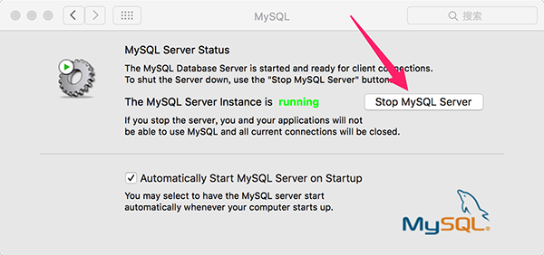

启动服务并登录MySQL数据库
---

这一小节介绍在Mac OS、Linux、Windows上启动关闭重启MySQL服务，以及部分图形化界面对服务的操控。

## 命令行启动关闭重启MySQL服务

在命令行终端启动 MySQL 非常方便，下面大概介绍几个平台通过命令启动服务的方法。

### Mac OS X 下命令操作

在 Mac 系统下操作起来就非常方便了。安装完之后就可以在终端上运行全局命令 mysql.server 命令，假设这个命令没有，你在系统的MySQL安装目录中找到 mysql.server  命令，运行它是一样的效果。

1. 启动：`mysql.server start`
2. 停止：`mysql.server stop`
3. 重启：`mysql.server restart`

当你安装过 MySQL 并没有找到 mysql.server 命令，那这时你需要找到安装目录中的 mysql.server 命令工具了，如 `sudo /usr/local/mysql/support-files/mysql.server start`

### Linux 下命令操作

Linux生态系统中对服务的操作有点区别。其实在 Mac 系统下也可以直接 `mysqld start` 来启动服务。

1. 启动：`service mysqld start`
2. 停止：`service mysqld stop`
3. 重启：`service mysqld restart`
3. 查看状态：`service mysqld status`
4. 查看状态：`systemctl status mysqld.service`

systemctl是一个systemd工具，主要负责控制systemd系统和服务管理器，在 Linux 系统中可以通过它来启动 mysql 服务。

启动过程中有可能会报错，错误处理，通过 **systemctl status mysqld.service** 和 **journalctl -xe** 命令查看服务启动失败的原因。

```bash
systemctl status mysqld.service

  ● mysqld.service - SYSV: MySQL database server.
     Loaded: loaded (/etc/rc.d/init.d/mysqld)
     Active: failed (Result: exit-code) since 三 2016-11-02 22:14:36 EDT; 11s ago
       Docs: man:systemd-sysv-generator(8)
    Process: 14940 ExecStart=/etc/rc.d/init.d/mysqld start (code=exited, status=1/FAILURE)
  
  11月 02 22:14:34 localhost.localdomain systemd[1]: Starting SYSV: MySQL database server....
  11月 02 22:14:35 localhost.localdomain mysqld[14940]: MySQL Daemon failed to start.
  11月 02 22:14:35 localhost.localdomain mysqld[14940]: Starting mysqld:  [FAILED]
  11月 02 22:14:36 localhost.localdomain systemd[1]: mysqld.service: control process exited, code=exited status=1
  11月 02 22:14:36 localhost.localdomain systemd[1]: Failed to start SYSV: MySQL database server..
  11月 02 22:14:36 localhost.localdomain systemd[1]: Unit mysqld.service entered failed state.
  11月 02 22:14:36 localhost.localdomain systemd[1]: mysqld.service failed.
```

```bash
# 查看配置文件 my.cnf 的位置
whereis my.cnf
# 输出： my: /etc/my.cnf

# 编辑
vi /etc/my.cnf
```

里面有个 log-error=/var/log/mysqld.log 的配置，通过命令 **tail -25 /var/log/mysqld.log** 查看 MySQL 错误日志

```bash
2016-01-20T10:00:19.935771Z 0 [ERROR] /usr/sbin/mysqld: Can't create/write to file '/var/run/mysqld/mysqld.pid' (Errcode: 2 - No such file or directory)
2016-01-20T10:00:19.935795Z 0 [ERROR] Can't start server: can't create PID file: No such file or directory
160120 18:00:20 mysqld_safe mysqld from pid file /var/run/mysqld/mysqld.pid ended
```

上面日志错误说，MySQL服务在启动的时候，不能创建pid文件。前去看一下 mysqld 文件是否存在，不存在创建 mysqld 目录。

```bash
# 创建 mysqld 目录
mkdir -p /var/run/mysqld/

# 启动MySQL
/etc/init.d/mysqld start

# 输出下面内容
# Starting mysqld (via systemctl):  Job for mysqld.service failed because the control process exited with error code. See "systemctl status mysqld.service" and "journalctl -xe" for details.
# [FAILED]
```

创建 mysqld 目录还是启动报错，按照下面命令尝试解决问题

```shell
ls -ld /var/run/mysqld/
# 会输出下面内容
# drwxr-xr-x. 2 mysql mysql 60 11月  2 22:15 /var/run/mysqld/
chown mysql.mysql /var/run/mysqld/
/etc/init.d/mysqld start
```

通过查看目录 /var/run/mysqld/ 的属主和属组还是root，mysql并不能在其中创建文件，后修改该目录的属主和属组，启动OK。

### Windows 下命令操作

Windows平台操作起来有点不顺手，个人感觉 Windows 的DOS太难用了，下面简单的介绍一下操作过程。先找到 MySQL 的安装位置，如我的电脑的安装位置是：C:\Program Files\MySQL\MySQL Server 5.7，我就执行这样的操作：开始->运行->输入“cmd”开启命令行，然后输入“C:”。通过命令进入到 MySQL Server 5.7 的 bin 目录下，输入 MySQL 命令行的服务启用命令，如下：

```bash
# net start [mysql服务名]

# 启动 mysql 服务
net start mysql 

# 停止 mysql 服务
net stop mysql 
```

有很多情况可能导致无法启动 MySQL，常见解决方法如下：

1. 在 CMD 命令中断运行这条命令 C:\Program Files\MySQL\MySQL Server 5.7\bin\mysqladmin-u root -p shutdown 来关闭MYSQL，如果有密码根据提示输入密码即可。
2. 在 CMD 命令中断，执行net start mysql启动 MySQL，参考上面方法来启动 MySQL 服务。


## 图像界面启动关闭重启MySQL服务

### Mac OS X 下操作

在 Mac 系统下如果你官方下载安装就可以在`系统偏好设置` > `MySQL` 里面点击 `Stop MySQL Server` 按钮进行启动关闭。



通过 [XAMMPP](https://www.apachefriends.org/zh_cn/index.html) 安装的 MySQL ，这个软件安装之后会自动安装 Apache + MySQL + PHP 对于初学者特别方便，新版本是默认安装`Apache + MariaDB + PHP + Perl`。

### Windows 下操作

Windows 系统下启动关闭重启MySQL服务。
