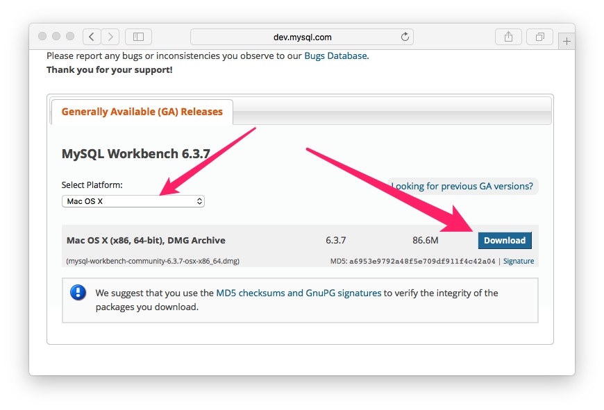
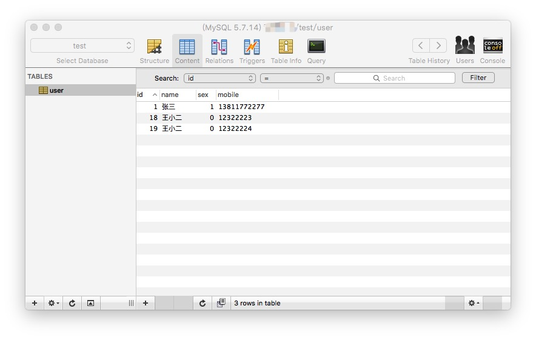
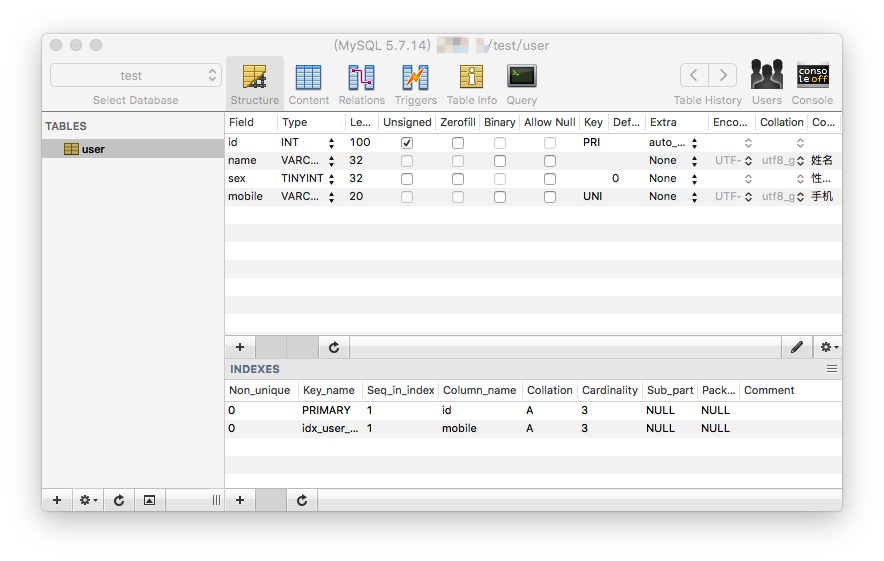
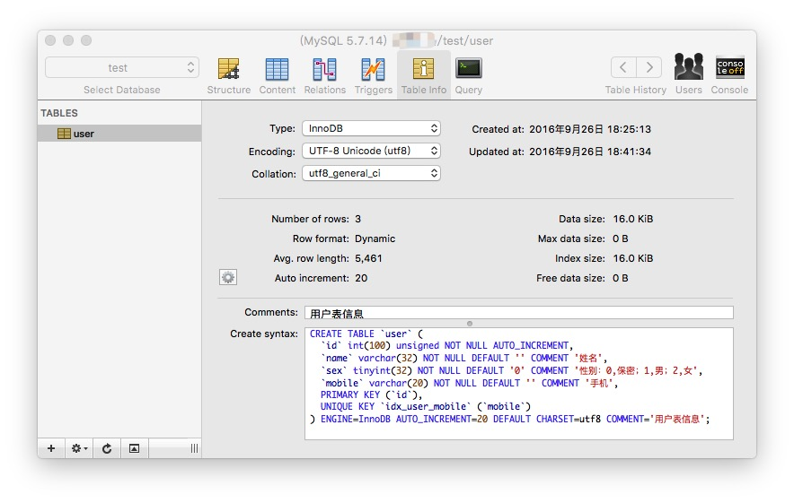

MySQL工具
===

由于 MySQL 软件是基于 C/S 模式的数据库管理系统（一个客户机—服务器DBMS），因此在日常各种工作中，可以通过各种客户端软件来与 MySQL 数据库管理系统关联。MySQL，需要有一个客户机，即你需要用来与MySQL打交道(给MySQL 提供要执行的命令)的一个应用。有许多客户机应用可供选择，但在学习MySQL(确切地说，在编写 和测试MySQL脚本时)，最好是使用专门用途的实用程序。官方自带 MySQL Command Line Client 和 MySQL-Workbench 客户端。

MySQL 官方数据库管理系统提供了许多的命令工具，这些工具可以用来管理 MySQL 服务器，对数据库进行访问、管理 MySQL 用户以及数据库备份和恢复工具等。而且 MySQL 提供图形化管理工具，这样操作更简单。

### 命令行使用程序

每个 MySQL 安装都有一个名为 MySQL 的简单命令行实用程序。这 个实用程序没有下拉菜单、流行的用户界面、鼠标支持或任何类似的东西。

#### MySQL 服务器端使用工具程序

1. `mysqld` - SQL 后台程序（即 MySQL 服务器进程）。该程序必须启动运行，才能连接服务器来访问数据库。
2. `mysqld_safe` - 服务器启动脚本，可以通过 mysqld_safe 来启动 mysqld 服务器。mysqld_safe 增加了一些安全特性，例如当前出现错误时重启服务器并向错误日至文件写入运行时间信息。
3. `mysql.server` - 服务器启动脚本。该脚本用于使用包含为特定级别的运行启动服务的脚本的运行目录的系统。
4. `mysqld_multi` - 服务器启动脚本，可以启动或停止系统上安装的多个服务器。

#### MySQL 安装相关程序

1. `comp_err` - 编译MySQL错误信息文件。
2. `mysql_install_db` - 该脚本用默认权限创建MySQL授权表。通常只是在系统上首次安装MySQL时执行一次。
3. `mysql_plugin` - 配置MySQL服务器插件。
4. `mysql_secure_installation` - 提高MySQL安装的安全性。
5. `mysql_ssl_rsa_setup` - 创建 SSL/RSA 文件。
6. `mysql_tzinfo_to_sql` - 加载时区表。
7. `mysql_upgrade` - 检查并升级MySQL表。

#### MySQL 客户端使用工具程序

1. `mysql` - MySQL命令行工具。
2. `mysqladmin` - 用于管理MySQL服务器客户端。
3. `mysqlcheck` - 表维护程序。
4. `mysqldump` - 数据库备份程序。
5. `mysqlimport` - 数据导入程序。
6. `mysqlpump` - 数据库备份程序。
7. `mysqlsh` - Shell下执行 mysql 命令。
8. `mysqlshow` - 显示数据库、表和列的信息，。
9. `mysqlslap` - 负载仿真客户端。

#### MySQL 程序开发工具

1. `mysql_config` - 编译客户端的显示选项。
2. `my_print_defaults` - 显示选项文件的选项。
3. `resolve_stack_dump` - 解析数字堆栈跟踪转储到符号。

#### MySQL 管理实用程序

1. `innochecksum` - 离线InnoDB文件校验工具。
2. `myisam_ftdump` - 显示全文索引信息。
3. `myisamchk` - MyISAM表维护实用工具。
4. `myisamlog` - 显示MyISAM日志文件内容。
5. `myisampack` - 产生压缩，只读MyISAM表。
6. `mysql_config_editor` - MySQL的配置实用程序。
7. `mysqlbinlog` - 处理二进制日志文件的效用。
8. `mysqldumpslow` - 总结慢查询日志文件。

#### 杂项程序

1. `lz4_decompress` - 解压缩mysqlpump lz4压缩输出。
2. `perror` - 解释错误代码。
3. `replace` - 一个字符串替换工具。
4. `resolveip` - 解析主机名到IP地址或反之亦然。
5. `zlib_decompress` - 解压缩mysqlpump zlib压缩输出。

MySQL 命令行实用程序是使用最多的实用程序之一，它对于快速测试 和执行脚本非常有价值。事实上，本书中使用的所有输出例子都是从 MySQL 命令行输出中抓取的。

### MySQL Workbench客户端

对于命令行客户端软件，想熟悉使用，必需对每一个相关命令需要非常熟悉，这对于现在初级 MySQL 用户来说，还得玩儿上好长一段时间。于是官方专卖开发了图形化客户端软件 [MySQL Workbench](http://dev.mysql.com/downloads/workbench/)，进入 [MySQL Workbench](http://dev.mysql.com/downloads/workbench/) 进行下载安装程序，这里安装我是按照默认选项安装，直接不停的下一步。



MySQL Workbench 主要是为数据库管理员和开发人员提供了一整套可视化数据看操作环境，主要有以下功能：

- 数据看设计和模型建立
- SQL开发(取代MySQL Query Browser)
- 数据看管理(取代MySQL Administrator)

MySQL Workbench以前老版本分两个版本，MySQL Workbench Community Edition(也叫 MySQL Workbench OSS，社区版本)和 MySQL Workbench Standard Edition （MySQL Workbench SE，商业版），商业版是收费的，现在官网只看到社区版，官网不在提供商业版的技术支持和更新了。

### 常用图形管理工具

MySQL Workbench 功能繁缛，操作复杂，而且在 Mac 上面启动慢操作不方便。对于太多大段英文操作界面十分不友好，长得也特别丑陋，所以在 Mac 上推荐一款界面简单、大方、好用的图形管理工具 [Sequel Pro](http://www.sequelpro.com/) 。这也是一个开源免费的软件，[源码在这里](https://github.com/sequelpro/sequelpro) 如果你有兴趣可研究研究它的源码，做出你的一点贡献。

Sequel Pro 安装也特别简单，有着 Mac 安装应用的风范，下载之后打开 dmg 拖拽 APP 到你的应用程序文件夹即可安装成功，下面是它漂亮的界面：





我在开发过程中一直使用它来配合命令行终端来使用。在这个过程中熟悉了不少命令，为今后在 Linux 服务器中也玩儿得如鱼得水，非常happy！个人小建议，终归是要熟悉一些命令行的，因为部署到生产环境，极为可能连操作系统都没有图形界面。


### MyCli替代MySQL的mysql命令行工具

[MyCli](http://mycli.net/) 是一个 MySQL 命令行工具，支持自动补全和语法高亮。也可用于 MariaDB 和 Percona。推荐好用的图形界面也得推荐好用的命令行工具，这个工具也是免费开源的，[源码在这里](https://github.com/dbcli/mycli) 


看上图就已经高潮了吧，它的安装也毫无压力，不费吹灰之力就搞定安装，没有复杂的配置，[MyCli](http://mycli.net/)实在太厉害了，不得不推荐它。安装方法如下：

```bash

# 如果你已会安装 Python 包，那就简单了：
$ pip install mycli

# 只能在 Mac OS X 中安装
$ brew update && brew install mycli  

# 只能在debian 或者 ubuntu 系统中安装
$ sudo apt-get install mycli 
```

工具的帮助文档，在命令行中运行`mycli --help`就可以输出帮助文档

```bash
$ mycli --help
Usage: mycli [OPTIONS] [DATABASE]

Options:
  -h, --host TEXT               数据库的主机地址。
  -P, --port INTEGER            用于连接的端口号。 Honors $MYSQL_TCP_PORT
  -u, --user TEXT               连接到数据库的用户名。
  -S, --socket TEXT             用于连接的套接字文件。
  -p, --password TEXT           连接到数据库的密码。
  --pass TEXT                   连接到数据库的密码。
  -v, --version                 mycli的版本输出。
  -D, --database TEXT           使用数据库。
  -R, --prompt TEXT             提示格式 (Default: "\t \u@\h:\d> ")
  -l, --logfile FILENAME        将每一个查询和它的结果记录到一个文件中。
  --defaults-group-suffix TEXT  读取指定的后缀的配置组。
  --defaults-file PATH          只从给定文件中读取默认选项。
  --auto-vertical-output        如果结果比终端更宽，自动切换到垂直输出模式。
  --login-path TEXT             从登录文件中读取此路径。
  --help                        显示此帮助消息
```


使用例子

```bash 
$ mycli local_database
$ mycli -h localhost -u root app_db
$ mycli mysql://amjith@localhost:3306/django_poll
```